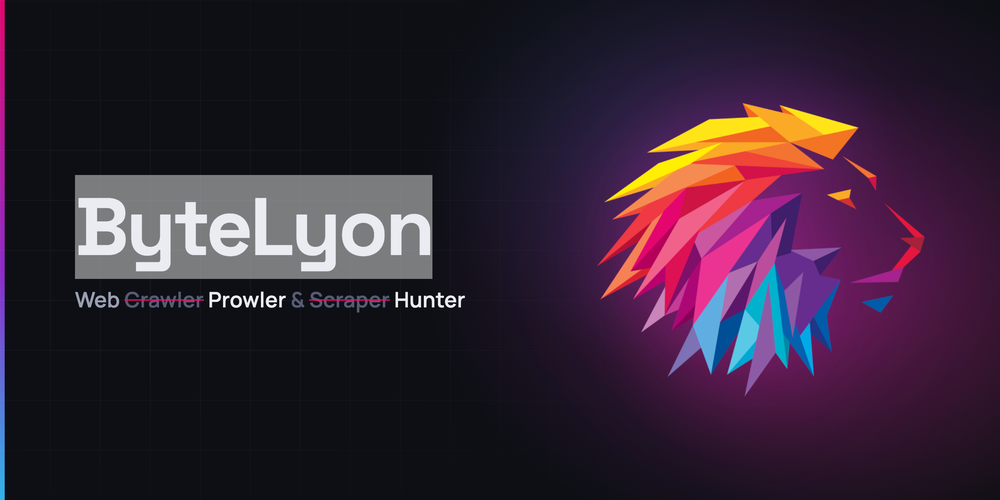
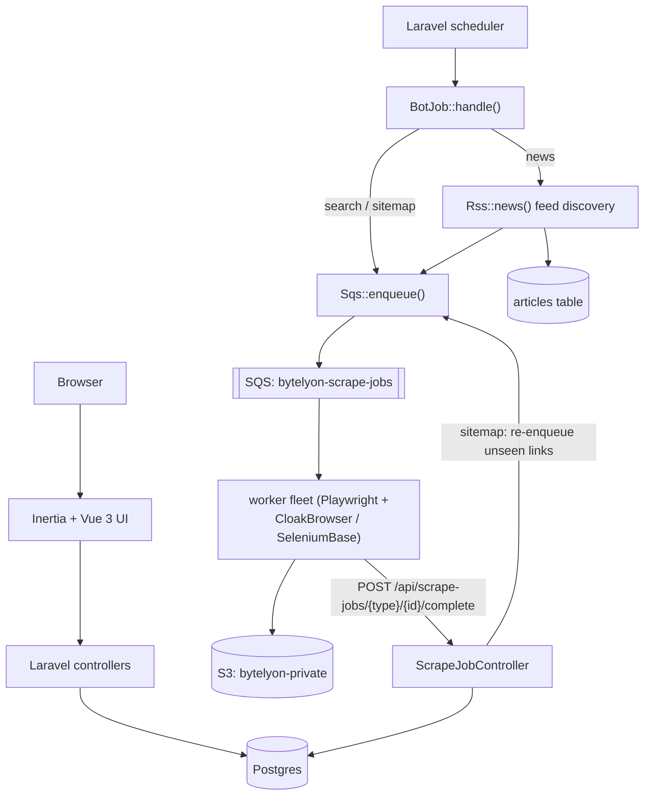

ByteLyon is a Web Prowler & Hunter: a Laravel + Inertia/Vue app for running
scheduled **Search** (Google SERP), **News** (RSS-driven article capture),
and **Sitemap** (site crawl) bots, backed by a horizontally-scalable fleet
of local browser workers for the actual page fetching.

## Architecture

Bots are dispatched on a schedule, each doing just enough work in PHP to
know _what_ to fetch, then handing the actual browsing off to the worker
fleet over SQS. Every worker response is the same shape
(`{url, screenshot_key, content_key}`) regardless of job type — all
parsing (SERP structure, article extraction, sitemap link discovery) lives
back in Laravel, not scattered across the Python workers. See
[`docker/worker/INSTRUCTIONS.md`](docker/worker/INSTRUCTIONS.md) for the
full worker-fleet flow, including exactly what gets POSTed back per job
type.
