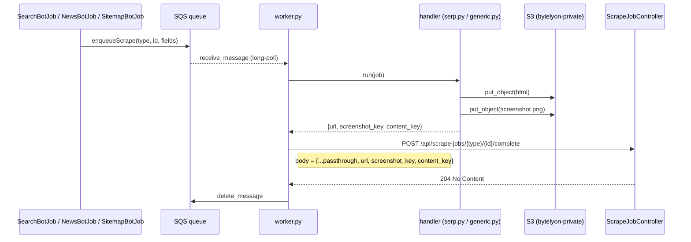

# bytelyon-worker: local-machine SQS worker (serp, news, sitemap)

One consolidated worker fleet for every bot type that needs a real browser:
Search (Google SERP), News (article capture), and Sitemap (site crawl). One
image, one queue, one location — replacing what used to be per-job-type
Lambda functions plus, most recently, a serp-only worker.

## Why local workers instead of Lambda

Google (and to a lesser extent other sites) trusts residential/home-network
egress far more than any datacenter IP, Lambda's own included. Running the
actual browser on a home network, driven by jobs pulled from a shared SQS
queue, sidesteps that entirely — and any number of machines can run this
same worker against the same queue for free, horizontal, pull-based scaling
(SQS's visibility timeout guarantees only one worker processes a given
message at a time).

## Architecture

```
SearchBotJob / NewsBotJob / SitemapBotJob  (Laravel)
  -> Sqs::enqueueScrape($type, $id, $fields)
  -> SQS queue: bytelyon-scrape-jobs[-dev]  (DLQ: ...-dlq, maxReceive=3)
       one queue pair per environment -- see "One-time setup" below
  -> worker.py (any number of machines, long-polling)
       -> handlers/serp.py    (type=serp)     launch+navigate w/ DataImpulse proxy
       -> handlers/generic.py (type=news|sitemap)  plain page.goto(url)
       -> both return {url, screenshot_key, content_key} — nothing else.
          No parsing happens in Python at all.
       -> uploads html/screenshot to s3://bytelyon-private/worker-scrapes/<type>/...
       -> POST {LARAVEL_BASE_URL}/api/scrape-jobs/{type}/{id}/complete
            Authorization: Bearer <worker-ability Sanctum token>
  -> ScrapeJobController (app/Http/Controllers/Api/ScrapeJobController.php)
       -> serp:    App\Support\Serp      parses SERP structure -> Serp::data
       -> news:    App\Data\Html\Page    parses article content -> Article
       -> sitemap: App\Support\Html      parses links -> Page rows + re-enqueues
                    unseen links (bounded by `depth`, carried in the job)
```

**Every worker's response payload is identical** regardless of job type:
`{url, screenshot_key, content_key}`. All parsing/business logic (SERP
structure, article body extraction, sitemap link discovery) lives in the
main Laravel app, in PHP, not scattered across Python handlers — one place,
one language, easy to test and iterate on without rebuilding/redeploying a
worker image.

### What actually gets POSTed back to Laravel



The POST body is `{**passthrough, **result}` (see `_handle_message` /
`_report_result` in `worker.py`) — every SQS message field _except_
`type`/`id`/`headless`, merged with the handler's `{url, screenshot_key,
content_key}`. Note `result` is spread last, so its `url` (the page's
final, post-navigation/redirect URL) always wins over any `url` the
original SQS message carried. Concretely, per job type:

```jsonc
// POST /api/scrape-jobs/search/42/complete
// SQS message was {"type": "search", "id": 42, "query": "sailing blocks"}
{
    "query": "sailing blocks", // passthrough — untouched by this worker
    "url": "https://www.google.com/search?q=sailing+blocks",
    "screenshot_key": "worker-scrapes/serp/3f9e.../www.google.com/search-a1b2c3d4e5.png",
    "content_key": "worker-scrapes/serp/3f9e.../www.google.com/search-a1b2c3d4e5.html",
}
```

(The `search` job type's own S3 key prefix and route parameter name are
still `serp`/`{serp}` — `handlers/serp.py` hardcodes `job_type="serp"` for
its S3 folder naming, and `routes/api.php` binds the `Serp` model via
`{serp}` — only the URI segment and SQS `type` field needed to agree on
`search` to fix the callback 404 this section used to describe
incorrectly.)

```jsonc
// POST /api/scrape-jobs/news/17/complete
// SQS message was {"type": "news", "id": 17, "url": "https://www.bbc.com/news/some-article"}
{
    "url": "https://www.bbc.com/news/some-article", // handler's result.url overrides passthrough's
    "screenshot_key": "worker-scrapes/news/7c1d.../www.bbc.com/news/some-article-5f6a7b8c9d.png",
    "content_key": "worker-scrapes/news/7c1d.../www.bbc.com/news/some-article-5f6a7b8c9d.html",
}
```

```jsonc
// POST /api/scrape-jobs/sitemap/5/complete
// SQS message was {"type": "sitemap", "id": 5, "url": "https://bytelyon.com/about", "depth": 4}
{
    "depth": 4, // passthrough — read by ScrapeJobController::sitemap() to gate re-enqueueing discovered links
    "url": "https://bytelyon.com/about",
    "screenshot_key": "worker-scrapes/sitemap/9a2b.../bytelyon.com/about-1a2b3c4d5e.png",
    "content_key": "worker-scrapes/sitemap/9a2b.../bytelyon.com/about-1a2b3c4d5e.html",
}
```

All three routes validate against the same rules
(`app/Concerns/ScrapeValidationRules.php`, used by
`app/Http/Requests/Api/PageSaveRequest.php`): `url` (required, valid URL),
`screenshot_key`/`content_key` (required strings), `depth` (nullable
integer, sitemap-only in practice but not type-restricted at the
validation layer).

### Two browser providers, one image

CloakBrowser Pro's license caps concurrent sessions at **5 seats**.
`handlers/serp.py` actually needs CloakBrowser's Google-specific stealth
patches and always uses it. `handlers/generic.py` (news/sitemap) doesn't —
ordinary websites are far less aggressive about bot detection — so it
defaults to **SeleniumBase's Stealthy Playwright Mode** instead
(`../images/seleniumbase-base/seleniumbase_playwright.py`, copied into this
image at build time), which has no such seat limit. That means news/sitemap
jobs never compete with serp jobs for one of the 5 coveted cloak seats, no
matter how many run concurrently.

Both providers are baked into the one image (see the Dockerfile's
multi-stage `COPY --from=` of the SeleniumBase shim). Set the _starting_
provider per job with a `provider` field in the SQS message (`"cloakbrowser"`
or `"seleniumbase"`), or fleet-wide with the `GENERIC_BROWSER_PROVIDER` env
var.

**Automatic fallback is wired up**: if the starting attempt raises (launch
or navigation failure) or comes back with a block-shaped HTTP status
(403/429/503), `handlers/generic.py` retries once with `cloakbrowser` --
never the other direction, and never past `cloakbrowser` (nothing left to
escalate to). A plain `page.goto` timeout is still treated as best-effort
(capture whatever loaded) rather than a trigger -- plenty of ordinary slow
pages hit that without being blocked at all.

At-least-once delivery: if a worker crashes or the callback POST fails, the
message is left alone (not deleted) and SQS redelivers it automatically
after the queue's visibility timeout (300s) — up to 3 attempts before it
lands in the DLQ. No retry logic needed in the worker itself.

## ⚠️ Before testing: sync code to the actual running app

The Sail dev stack (`bytelyon-server-1`) mounts `~/PhpstormProjects/bytelyon`,
**not** this checkout (`~/tmp/bytelyon`, branch `bugfix/flaky-serp`). All of
the following need to exist there too before any callback endpoint works:

- `routes/api.php` (the three `scrape-jobs/{type}/{id}/complete` routes)
- `app/Http/Controllers/Api/ScrapeJobController.php`
- `../../app/Http/Requests/Api/PageSaveRequest.php`
- `app/Support/Serp.php`
- `app/Services/SqsService.php`
- `app/Facades/Sqs.php`
- `app/Jobs/SearchBotJob.php`, `app/Jobs/NewsBotJob.php`, `app/Jobs/SitemapBotJob.php`
- `config/services.php` (`sqs` block)
- `.env` — add `SQS_SCRAPE_JOBS_QUEUE_URL=...` pointing at whichever queue
  matches that checkout's own environment (`bytelyon-scrape-jobs-dev` for a
  local/dev app, `bytelyon-scrape-jobs` for production — see "One-time
  setup" below for why these must stay paired with a matching worker)
- `tests/Feature/Jobs/{Search,News,Sitemap}BotJobTest.php` (updated to mock `Sqs` instead of asserting synchronous side effects)

Easiest path is probably pushing this branch and pulling/merging it into the
other checkout, rather than copying files by hand.

## One-time setup

**1. Issue a worker API token** (once the code above is live): log in as
whichever user should own the "system scraper" identity, go to
Settings → API Tokens, create one (any name) — it's automatically issued
the `worker` ability (`ApiTokenController::store`). Copy the plaintext
token shown once.

**2. AWS resources** (already created, nothing to do unless rebuilding from
scratch) — **one queue pair per environment**, not one shared queue:

|                                      | Production                 | Dev/local                      |
| ------------------------------------ | -------------------------- | ------------------------------ |
| Queue                                | `bytelyon-scrape-jobs`     | `bytelyon-scrape-jobs-dev`     |
| DLQ                                  | `bytelyon-scrape-jobs-dlq` | `bytelyon-scrape-jobs-dev-dlq` |
| `.env`'s `SQS_SCRAPE_JOBS_QUEUE_URL` | points at the prod queue   | points at the dev queue        |

Both pairs use the same settings (300s visibility timeout, 20s long-poll,
4-day retention, redrive after 3 receives) and the same IAM user,
`bytelyon-worker` — its policy already covers `sqs:ReceiveMessage` /
`sqs:DeleteMessage` / `sqs:GetQueueAttributes` on _both_ queues, plus
`s3:PutObject` on `bytelyon-private/worker-scrapes/*`. Rotate its access key
via `aws iam create-access-key --user-name bytelyon-worker` /
`aws iam delete-access-key ...` if needed.

**Why two queues instead of one `--laravel-base-url` switch on a shared
queue**: a job's `id` only means anything against the database it was
enqueued from. A dev-enqueued job picked up by a prod-pointed worker (or
vice versa) would either 404 or silently complete a same-numbered but
totally unrelated production/dev record. Keeping the queues themselves
separate makes that class of mistake structurally impossible instead of
relying on remembering to set the right env var every time.

## Running a worker

Every setting has both a CLI flag and an env var — the flag wins if both are
given. Env vars suit `docker run -e`; flags suit one-off overrides or
running the script directly. `python3 worker.py --help` lists all of them.

```bash
# From this directory:
docker buildx build --platform linux/arm64 --provenance=false --sbom=false \
  -t bytelyon-worker:arm64 --load .
```

After any change to this worker fleet's Python code (`common.py`,
`worker.py`, `handlers/*.py`), run `./update.sh` instead of the above --
it refreshes the ECR auth token (which expires periodically and otherwise
fails the build partway through with a bare 403), then rebuilds _both_
tags this repo actually uses in one shot: the standalone
`bytelyon-worker:arm64` above, and `worker-1.0/app:latest` (the tag
`../../compose.yml`'s `worker` service runs, via `docker compose build
worker`) -- easy to update one and forget the other otherwise. Neither
command restarts an already-running container; recreate whichever one you
actually run afterward to pick up the change (`update.sh`'s own output
prints the exact command either way).

**Local dev** (points at `bytelyon-scrape-jobs-dev` + this machine's own Sail app):

```bash
docker run -d --name bytelyon-worker-dev --restart unless-stopped \
  -e AWS_ACCESS_KEY_ID=<bytelyon-worker access key> \
  -e AWS_SECRET_ACCESS_KEY=<bytelyon-worker secret key> \
  bytelyon-worker:arm64 python3 worker.py \
  --queue-url https://sqs.us-east-1.amazonaws.com/138305277395/bytelyon-scrape-jobs-dev \
  --laravel-base-url http://host.docker.internal \
  --worker-token <dev-app Sanctum token>
```

**Production** (points at `bytelyon-scrape-jobs` + the public site):

```bash
docker run -d --name bytelyon-worker --restart unless-stopped \
  -e AWS_ACCESS_KEY_ID=<bytelyon-worker access key> \
  -e AWS_SECRET_ACCESS_KEY=<bytelyon-worker secret key> \
  bytelyon-worker:arm64 python3 worker.py \
  --queue-url https://sqs.us-east-1.amazonaws.com/138305277395/bytelyon-scrape-jobs \
  --laravel-base-url https://bytelyon.com \
  --worker-token <production Sanctum token>
```

`docker logs -f bytelyon-worker` (or `-dev`) either way.

`http://host.docker.internal` reaches the Sail app's port 80 on the Docker
host — works out of the box on Docker Desktop for Mac. If the worker runs
on a genuinely different machine than the Laravel app it's reporting to (a
separate box on the same LAN, or a machine reporting to production over the
internet), it needs a real, reachable URL instead — that's exactly what
`--laravel-base-url`/`LARAVEL_BASE_URL` is for.

`GENERIC_BROWSER_PROVIDER` (env-only, no CLI flag currently) is optional —
defaults to `seleniumbase` already (see "Two browser providers, one image"
above); only set it to `cloakbrowser` if you want news/sitemap jobs to use
CloakBrowser fleet-wide instead.

Run as many workers as you want _per environment_ — they all pull from
their one queue and handle whatever job type comes up (serp/news/sitemap),
and SQS's visibility timeout guarantees no two workers process the same job
concurrently. Don't point a dev and a prod worker at the same queue (see
above for why).

**Always stop workers before rebuilding**
(`docker stop bytelyon-worker && docker rm bytelyon-worker`) — a running
worker holds no external lock, but you'll otherwise have two containers
racing to poll the same queue with old vs new code.

## Manual testing without the full Laravel loop

Enqueue a job directly (bypassing the Bot jobs) to test a handler + S3 side
in isolation — the callback POST will 404/fail until a real record + live
route exist, which is expected; the worker just leaves the message for
redrive in that case. Use the **dev** queue for this so stray test jobs
never land in front of a production worker:

```bash
DEV_QUEUE=https://sqs.us-east-1.amazonaws.com/138305277395/bytelyon-scrape-jobs-dev

# serp
aws sqs send-message --queue-url $DEV_QUEUE --region us-east-1 \
  --message-body '{"type":"serp","id":1,"query":"sailing blocks"}'

# news
aws sqs send-message --queue-url $DEV_QUEUE --region us-east-1 \
  --message-body '{"type":"news","id":1,"url":"https://www.bbc.com/news"}'

# sitemap (root of a crawl)
aws sqs send-message --queue-url $DEV_QUEUE --region us-east-1 \
  --message-body '{"type":"sitemap","id":1,"url":"https://bytelyon.com","depth":5}'
```

## Known trade-offs (from moving these off a single synchronous execution)

- **Sitemap freshness**: only the root URL is unconditionally re-crawled on
  every bot run. A previously-discovered page only refreshes if it's
  re-reachable via some newly-discovered path this run — it's no longer
  proactively re-crawled just because it was seen before. The persisted
  `pages` table is now the crawl's "seen" set (replacing what used to be an
  in-memory set scoped to one job execution).
- **No aggregate "N found" notification** for sitemap crawls (there's no
  single point in time that "the crawl finished" in a distributed,
  re-enqueueing design without extra completion-tracking infra). News still
  fires `BotResultsPersisted` at _enqueue_ time ("N articles queued"),
  reworded from the old "N articles found" since the actual scraping now
  happens later, asynchronously.
- **SERP link resolution**: `App\Support\Serp::resolveUrl()` only decodes
  Google's simple `/url?q=<destination>` redirect format directly from the
  query string — no live HTTP request. Confirmed against real captured SERPs
  that Google also uses an opaque `/goto?url=<encoded-token>` format for some
  results, which can't be decoded without a live request through Google's own
  redirect service; those links currently pass through unresolved
  (`domain` ends up as `google.com` rather than the true destination). The
  Python version used to resolve these via a real HTTP request through the
  same browser/proxy session; that capability didn't move to PHP. Worth
  revisiting if destination-URL accuracy matters more than the current
  title/kind/index-only fidelity for those specific results.
