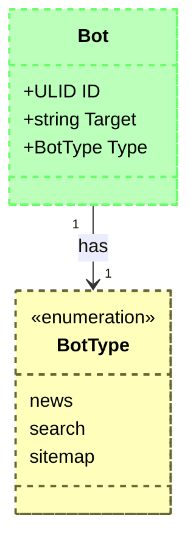

# ByteLyon (Server)


## Requirements
[Go](https://go.dev/doc/install) (1.20+) is required to launch the application and develop it locally.
***

## Data Model



***

## 🚀 Launch
### Run
```shell
go run ./cmd/app
```

### Build
```shell
go build -o ./bin/ByteLyonServer ./cmd/app
```

## 📊 Cover
```shell
go get -v ./... && go test -v -cover ./...
```
Add color grades to report metrics by installing and running `richgo`.
```shell
go get -u github.com/kyoh86/richgo
```
```shell
go get -v ./... && richgo test -v ./...
```

### 🧰 Helpers
A collection of commands to for improved code quality and developer experience.

#### 💀 Kill
The `serve()` function in `server.go` everything possible to handle shutdowns with grace.
That said, it's still possible (albeit unlikely) for the app to become a zombie process.
If the app is telling you that there is already a process running on the given port, run this:
```shell
PORT=2020
kill -9 $(lsof -ti:${PORT})
```

#### Clean
Remove files and directories created while running or developing the app locally.
```shell
rm -rf ./bin
```

#### Deps
Install
```shell
go get -v ./...
```

Update
```shell
go mod tidy
```

#### Lint
While the `go` source format criteria is very strict, there is nothing defined for linting.
`golangci-lint` has filled this gap successfully with objective and performant suggestions.
```shell
curl -sSfL https://raw.githubusercontent.com/golangci/golangci-lint/HEAD/install.sh | sh -s -- -b $(go env GOPATH)/bin v2.8.0")
```
```shell
golangci-lint run -v
```

#### Quality
`goreportcard` is the tool of choice by most gophers for scoring project src quality.
```shell
git clone https://github.com/gojp/goreportcard.git \
	&& cd goreportcard \
	&& make install \
	&& go install ./cmd/goreportcard-cli
```
```shell
goreportcard-cli -v
```

### Resources
#### Golang
* [Gin](https://gin-gonic.com/) - The fastest full-featured web framework for Go
* [Go](https://go.dev/doc/build-cover) - Coverage profiling support for integration tests
* [Go](https://go.dev/doc/modules/layout) - Organizing a Go Module
* [Go](https://go.dev/doc/tutorial/compile-install) - Compile and install the application
* [Go](https://pkg.go.dev/cmd/go#hdr-Compile_packages_and_dependencies) - Command Documentation
* [Go](https://tutorialedge.net/golang/the-go-init-function/) - The `init()` function
* [Go Report Card](https://github.com/gojp/goreportcard) - Grade the quality of Go projects
* [GoFakeIt](https://github.com/brianvoe/gofakeit) - Random data generator written in go
* [GORM](https://gorm.io/docs/polymorphism.html) - The fantastic ORM library for Golang
* [richgo](https://github.com/kyoh86/richgo) - enrich `go test` outputs with text decorations
* [SQLite](https://sqlite.org) - Small. Fast. Reliable. Choose any three.
* [Testify](https://github.com/stretchr/testify) - Thou Shalt Write Tests
* [ULID](https://github.com/oklog/ulid) - Universally Unique Lexicographically Sortable Identifier
* [ZeroLog](https://github.com/rs/zerolog) - Zero Allocation JSON Logger